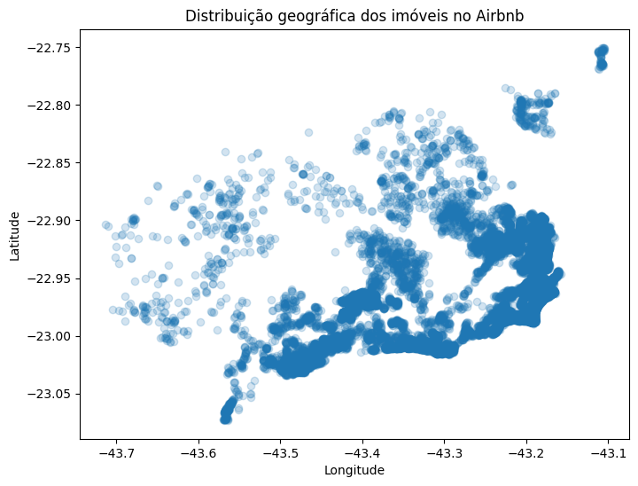
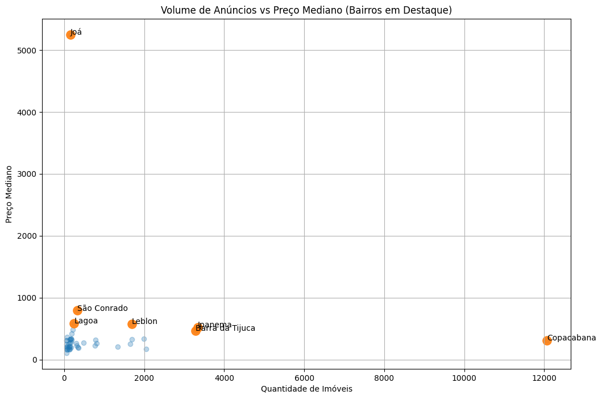

# 🏠 Análise de Dados do Airbnb no Rio de Janeiro

---

## 📌 Contexto do Projeto

Neste projeto, fomos contratados por uma plataforma de aluguel de imóveis para analisar dados do Airbnb na cidade do Rio de Janeiro.

O objetivo é compreender o comportamento dos preços dos imóveis disponíveis na plataforma, bem como identificar padrões e fatores que influenciam esses valores.

Essas informações são essenciais para apoiar decisões estratégicas, como definição de preços, posicionamento de imóveis e melhoria da competitividade na plataforma.

---

## 🎯 Objetivo

Realizar uma análise exploratória dos dados do Airbnb no Rio de Janeiro com o intuito de:

- Identificar os principais fatores que influenciam o preço dos imóveis  
- Analisar a variação de preços entre diferentes regiões e tipos de acomodação  
- Explorar padrões nos dados que possam gerar insights relevantes para o negócio  
- Preparar os dados para possíveis aplicações em modelos preditivos  

---

## 🛠️ Tecnologias Utilizadas

- Python  
- Pandas  
- Matplotlib  
- Plotly  

---

## 📊 Base de dados

- Fonte: [Inside Airbnb](http://insideairbnb.com/)  
- Arquivo utilizado: `listings.csv` (Rio de Janeiro)  

O dataset contém informações sobre imóveis disponíveis no Airbnb, incluindo localização, preço, tipo de acomodação, número de avaliações e disponibilidade ao longo do ano.

---

## 📁 Estrutura do Projeto

```
analise-airbnb-rio-de-janeiro/
│
├── notebooks/
│   └── analise_airbnb_rio.ipynb
│
├── data/
│   └── listings.csv
│
└── assets/
    └── graficos/
```

---

## 📌 Perguntas de Negócio

- Como os imóveis estão distribuídos geograficamente e por volume?  
- Qual a mediana de preço por bairro e como o volume de anúncios influencia esse valor?  
- Qual é a tipologia de imóvel predominante em cada região?  
- Imóveis com mais avaliações tendem a ser mais baratos?  
- Qual a disponibilidade média dos imóveis ao longo do ano por região?  

---

## 📈 Etapas da Análise

O projeto foi estruturado nas seguintes etapas:

- Entendimento dos dados  
- Tratamento de dados e limpeza  
- Remoção de registros inconsistentes  
- Análise Exploratória de Dados (EDA)  
- Geração de insights  
- Conclusão  

---

## 📊 Principais Insights

- O mercado é fortemente concentrado na Zona Sul, com destaque para Copacabana, Ipanema e Leblon, além de apresentar expansão para a Zona Oeste (Barra da Tijuca).  

- Não há relação direta entre volume de anúncios e preço: regiões com alta oferta tendem a ser mais competitivas, enquanto bairros premium mantêm preços elevados.  

- A tipologia predominante é de imóveis inteiros, especialmente em regiões de alto padrão.  

- Imóveis mais baratos acumulam maior número de avaliações, indicando maior demanda e rotatividade.  

- A disponibilidade média não apresentou diferenças significativas entre bairros caros e baratos, sugerindo influência de múltiplos fatores além do preço.  

---

## 📊 Visualizações

Alguns dos principais gráficos utilizados na análise:

### Distribuição geográfica dos imóveis



### Relação entre volume de anúncios e preço mediano



---

## 🧠 Conclusão

A análise evidenciou que o mercado de Airbnb no Rio de Janeiro é influenciado por uma combinação de fatores como localização, volume de oferta, tipologia dos imóveis e perfil de demanda.

Esses elementos definem diferentes estratégias de precificação e posicionamento dentro da plataforma.

---

## 🚀 Próximos Passos

- Desenvolvimento de modelos preditivos de preço  
- Análise de ocupação dos imóveis  
- Criação de dashboard interativo  
